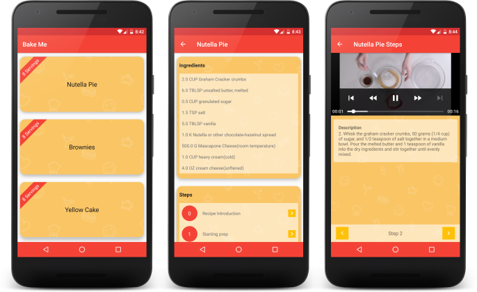
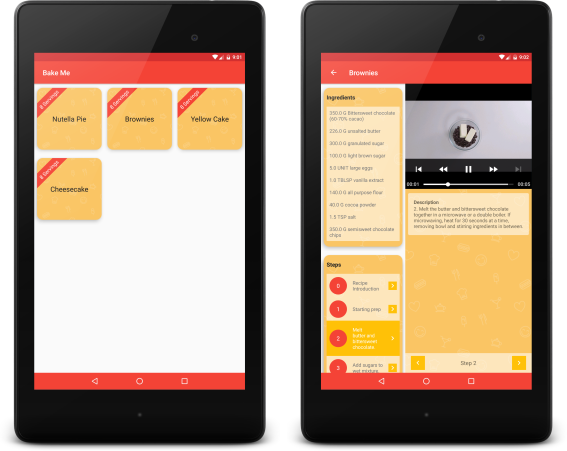
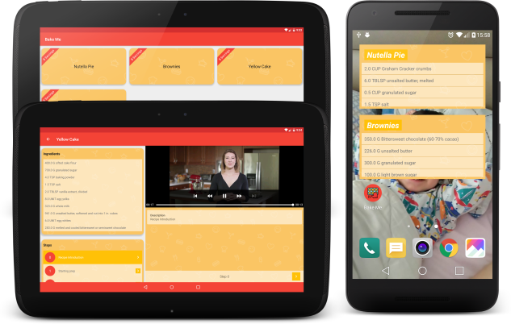

## Baking App (Bake Me)

Fourth project(P3) for Android Nanodegree by Udacity.

#### What Will I Learn?

In this project I will:

* Use MediaPlayer/Exoplayer to display videos.

* Handle error cases in Android.

* Add a widget to your app experience.

* Leverage a third-party library in your app.

* Use Fragments to create a responsive design that works on phones and tablets.

#### App Description

Your task is to create a Android Baking App that will allow Udacity’s resident baker-in-chief, Miriam, to share her recipes with the world. You will create an app that will allow a user to select a recipe and see video-guided steps for how to complete it.

The JSON file contains the recipes' instructions, ingredients, videos and images you will need to complete this project. Don’t assume that all steps of the recipe have a video. Some may have a video, an image, or no visual media at all.

One of the skills you will demonstrate in this project is how to handle unexpected input in your data -- professional developers often cannot expect polished JSON data when building an app.

### Screenshots

Phone (Nexus 5X)

Tablet (Nexus 7)

Tablet (Nexus 10 & Widget on Phone)

### Credits

#### Libraries

   [Retrofit](https://github.com/square/retrofit)

   [Picasso](https://github.com/square/picasso)

   [ViewModel and LiveData](https://developer.android.com/topic/libraries/architecture/adding-components.html)

   [Materialish Progress](https://github.com/pnikosis/materialish-progress)

   [Butterknife](https://github.com/JakeWharton/butterknife)

   [Parceler](https://github.com/johncarl81/parceler)

   [ExoPlayer](https://github.com/google/ExoPlayer)

   [Espresso](https://developer.android.com/training/testing/espresso/)

   [Stetho](https://github.com/facebook/stetho)

   [SimpleTagImageView](https://github.com/wujingchao/SimpleTagImageView)

#### Icons

App Icon made by [Freepik](https://www.flaticon.com/authors/mynamepong) from www.flaticon.com

## License

Copyright 2018 Figen Güngör

Licensed under the Apache License, Version 2.0 (the "License");
you may not use this file except in compliance with the License.
You may obtain a copy of the License at

    http://www.apache.org/licenses/LICENSE-2.0

Unless required by applicable law or agreed to in writing, software
distributed under the License is distributed on an "AS IS" BASIS,
WITHOUT WARRANTIES OR CONDITIONS OF ANY KIND, either express or implied.
See the License for the specific language governing permissions and
limitations under the License.